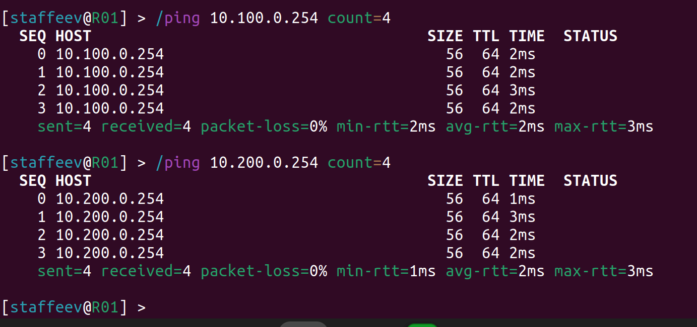

University: [ITMO University](https://itmo.ru/ru/)
Faculty: [FICT](https://fict.itmo.ru)
Course: [Introduction in routing](https://github.com/itmo-ict-faculty/introduction-in-routing)
Year: 2025/2026
Group: K3321
Author: Stafeev Ivan Alekseevich
Lab: Lab1
Date of create: 20.09.2025
Date of finished: 22.09.2025

## Лабораторная работа №1. Установка ContainerLab и развертывание тестовой сети связи

**Цель работы**: ознакомиться с инструментом ContainerLab и методами работы с ним, изучить работу VLAN, IP адресации и т.д.

### Схема сети


Топология этой сети в yaml имеет следующий вид:

```yml
name: lab1

mgmt:
  network: my_mgmt
  ipv4-subnet: 172.50.0.0/24

topology:
  kinds:
    vr-ros:
      image: vrnetlab/mikrotik_routeros:6.47.9
    linux:
      image: alpine:latest
  nodes:
    R01.TEST:
      kind: vr-ros
      mgmt-ipv4: 172.50.0.2
      startup-config: node_configs/router.rsc
    SW01.L3.01.TEST:
      kind: vr-ros
      mgmt-ipv4: 172.50.0.3
      startup-config: node_configs/switch01.rsc
    SW02.L3.01.TEST:
      kind: vr-ros
      mgmt-ipv4: 172.50.0.4
      startup-config: node_configs/switch02.01.rsc
    SW02.L3.02.TEST:
      kind: vr-ros
      mgmt-ipv4: 172.50.0.5
      startup-config: node_configs/switch02.02.rsc
    PC1:
      kind: linux
      mgmt-ipv4: 172.50.0.101
      binds:
        - ./node_configs:/node_configs
      exec:
        - sh /node_configs/endpoint1.sh
    PC2:
      kind: linux
      mgmt-ipv4: 172.50.0.102
      binds:
        - ./node_configs:/node_configs
      exec:
        - sh /node_configs/endpoint2.sh
  links:
    - endpoints: ["R01.TEST:eth1", "SW01.L3.01.TEST:eth1"]
    - endpoints: ["SW01.L3.01.TEST:eth2", "SW02.L3.01.TEST:eth1"]
    - endpoints: ["SW01.L3.01.TEST:eth3", "SW02.L3.02.TEST:eth1"]
    - endpoints: ["SW02.L3.01.TEST:eth2", "PC1:eth1"]
    - endpoints: ["SW02.L3.02.TEST:eth2", "PC2:eth1"]
```

Задаются 4 роутера и два конечных устройства с указанием стартовых конфигов. Затем задаются линки между всеми устройствами по аналогии со схемой.

Граф, созданный при помощи `clab graph`, показывает, что топлогия собрана правильно.


### Конфигурация роутеров


Начнем с настройки головного роутера с DHCP-сервером. Для изменения имени устройства и смены лгина и паролей использутся следующие команды (для других роутеров они аналогичны):

```bash
/system identity
set name=R01

/user
add name=staffeev password=strongpassword group=full
```

Следом создаются VLAN100 и VLAN200 поверх интерфейса eth1 (в конфиге прибавляется 1 ко всем номерам интерфейсов) и задаются на них ip-адреаса:

```bash
/interface vlan
add name=VLAN100 vlan-id=100 interface=ether2
add name=VLAN200 vlan-id=200 interface=ether2

/ip address
add address=10.100.0.1/24 interface=VLAN100
add address=10.200.0.1/24 interface=VLAN200
```

Для настройки DHCP-сервера нужно выполнить несколько этапов: 1) создание пула адресов; 2) добавление сетей и шлюзов; 3) добавление этого всего в конфиг сервера. Выполняется при помощи следующих команд:

```bash
/ip pool
add name=dhcp_vlan100_pool ranges=10.100.0.100-10.100.0.254
add name=dhcp_vlan200_pool ranges=10.200.0.100-10.200.0.254

/ip dhcp-server network
add address=10.100.0.0/24 gateway=10.100.0.1
add address=10.200.0.0/24 gateway=10.200.0.1

/ip dhcp-server
add address-pool=dhcp_vlan100_pool disabled=no interface=VLAN100 name=dhcp_vlan100
add address-pool=dhcp_vlan200_pool disabled=no interface=VLAN200 name=dhcp_vlan200
```

На маршрутизаторах создаются вначале виртуальные интерфейсы типа `bridge`, так как именно они нужны для работы VLAN и так как они всегда в активном состоянии:

```bash
/interface bridge
add name=bridge1 vlan-filtering=yes
```

(указание `vlan-filtering` обязательно)

После интерфейсы маршрутизатора надо добавить в этот бридж и создать сами VLAN так же, как на роутере. Здесь рассмаривается все на примере маршрутизатора `Sw01.L3.01.TEST`:

```bash
/interface bridge port
add bridge=bridge1 interface=ether2
add bridge=bridge1 interface=ether3
add bridge=bridge1 interface=ether4

/interface vlan
add name=VLAN100 vlan-id=100 interface=bridge1
add name=VLAN200 vlan-id=200 interface=bridge1
```

В конце необходимо настроить состояние портов (access и trunk). На этом маршрутизаторе все порты в состоянии trunk (то есть они tagged):

```bash
/interface bridge vlan
add bridge=bridge1 vlan-ids=100 tagged=bridge1,ether2,ether3,ether4
add bridge=bridge1 vlan-ids=200 tagged=bridge1,ether2,ether3,ether4
```

На маршрутизаторах `SW02.L3.01.TEST` и `SW02.L3.02.TEST` настройка выглядит похожим образом. Вот для первого из них:

```
/interface bridge
add name=bridge1 vlan-filtering=yes

/interface bridge port
add bridge=bridge1 interface=ether2
add bridge=bridge1 interface=ether3 pvid=100

/interface vlan
add name=VLAN100 vlan-id=100 interface=bridge1

/ip address
add address=10.100.0.3/24 interface=VLAN100

/interface bridge vlan
add bridge=bridge1 vlan-ids=100 tagged=bridge1,ether2 untagged=ether3
```

Из изменений только указание `pvid=100` в настройке бриджа (нужно для пропука пакетов с меткой этого номера VLAN), а порт, идущий к конечному устройству, надо сделать в access (он будет untagged).

Для `SW02.L3.02.TEST` все аналогично:

```bash
/interface bridge
add name=bridge1 vlan-filtering=yes

/interface bridge port
add bridge=bridge1 interface=ether2
add bridge=bridge1 interface=ether3 pvid=200

/interface vlan
add name=VLAN200 vlan-id=200 interface=bridge1

/ip address
add address=10.200.0.3/24 interface=VLAN200

/interface bridge vlan
add bridge=bridge1 vlan-ids=200 tagged=bridge1,ether2 untagged=ether3
```


### Конфигурация конечных устройств

```bash
#!/bin/sh

ip link set eth1 up
udhcpc -i eth1 -q

ip route add 10.200.0.0/24 via 10.100.0.1 dev eth1
```

Через `udhcp` происходит запрос ip-адреса у DHCP-сервера. Для настройки interVLAN-routing прописывается путь к нужной сети  использованием шлюза - виртуального интерфейса на маршрутизаторе.

Для PC2 достаточно лиш поменять последнюю строку на 

```bash
ip route add 10.100.0.0/24 via 10.200.0.1 dev eth1
```


### Проверка работоспособности

Деплой при помощи команды `clab deploy -t <путь к yaml>` происходит успешно:


На роутере `R01.TEST` проверяем (`/ip dhcp lease print`), что DHCP-сервер отработал корректно и выдал по адресу из заданнных пулов конечным устройствам.


С роутера пингуются все созданные ранее интерфейсы


и конечные устройства

.

Аналогично срабатываает пинг с маршрутизаторов.

Теперь проверка на конечных устройствах. Видно, что PC1 получил действительно ip-адрес и что он может пинговать PC2:

.

Аналогично для PC2:

.

Локальная связность установлена.

### Заключение

В ходе выполнения лабораторной работы была создана топология сети, состоящая из трех роутеров и трех конечных устройств. Настроена раздача адресов через DHCP и статическая маршрутизация. Таким образом, все конечные устройства из разных географических зон могут общаться друг с другом. Цель работы достигнута.