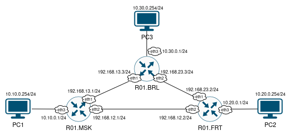
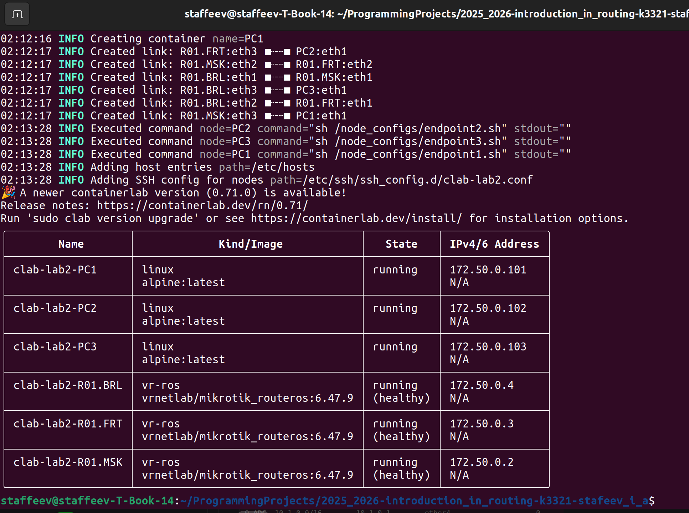
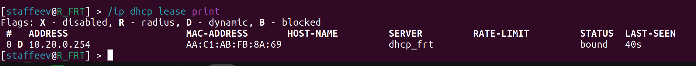
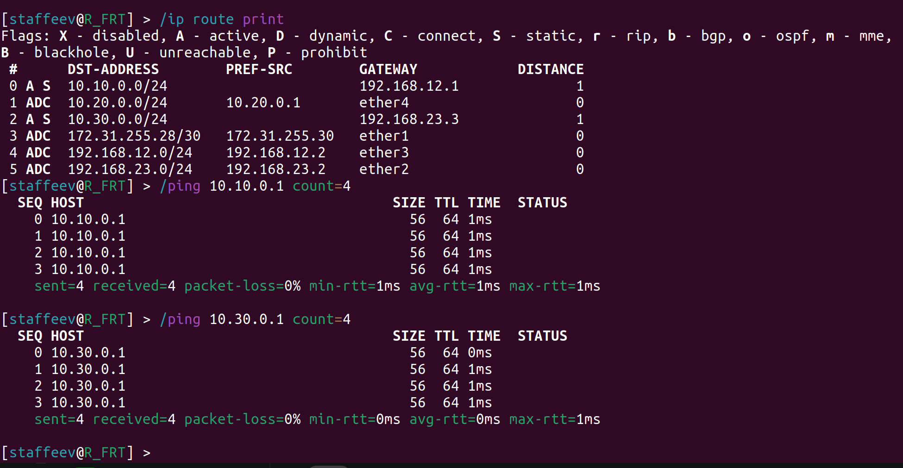
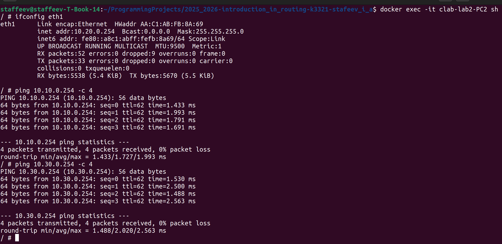

University: [ITMO University](https://itmo.ru/ru/)
Faculty: [FICT](https://fict.itmo.ru)
Course: [Introduction in routing](https://github.com/itmo-ict-faculty/introduction-in-routing)
Year: 2025/2026
Group: K3321
Author: Stafeev Ivan Alekseevich
Lab: Lab2
Date of create: 12.10.2025
Date of finished: 13.10.2025

## Лабораторная работа №2. Эмуляция распределенной корпоративной сети связи, настройка статической маршрутизации между филиалами

**Цель работы**: ознакомиться с принципами планирования IP адресов, настройке статической маршрутизации и сетевыми функциями устройств.

### Схема сети



Топология этой сети в yaml имеет простой вид:

```yml
name: lab2

mgmt:
  network: my_mgmt
  ipv4-subnet: 172.50.0.0/24

topology:
  kinds:
    vr-ros:
      image: vrnetlab/mikrotik_routeros:6.47.9
    linux:
      image: alpine:latest
  nodes:
    R01.FRT:
      kind: vr-ros
      mgmt-ipv4: 172.50.0.3
      startup-config: node_configs/r01_frt.rsc
    R01.BRL:
      kind: vr-ros
      mgmt-ipv4: 172.50.0.4
      startup-config: node_configs/r01_brl.rsc
    R01.MSK:
      kind: vr-ros
      mgmt-ipv4: 172.50.0.2
      startup-config: node_configs/r01_msk.rsc
    PC1:
      kind: linux
      mgmt-ipv4: 172.50.0.101
      binds:
        - ./node_configs:/node_configs
      exec:
        - sh /node_configs/endpoint1.sh
    PC2:
      kind: linux
      mgmt-ipv4: 172.50.0.102
      binds:
        - ./node_configs:/node_configs
      exec:
        - sh /node_configs/endpoint2.sh
    PC3:
      kind: linux
      mgmt-ipv4: 172.50.0.103
      binds:
        - ./node_configs:/node_configs
      exec:
        - sh /node_configs/endpoint3.sh
  links:
    - endpoints: ["R01.BRL:eth3", "PC3:eth1"]
    - endpoints: ["R01.MSK:eth3", "PC1:eth1"]
    - endpoints: ["R01.FRT:eth3", "PC2:eth1"]
    - endpoints: ["R01.BRL:eth1", "R01.MSK:eth1"]
    - endpoints: ["R01.BRL:eth2", "R01.FRT:eth1"]
    - endpoints: ["R01.MSK:eth2", "R01.FRT:eth2"]
```

В сущности задаются три роутера с указанием стартового конфига и три компьютера, также с указанием конфига, а также связии между ними по аналогии со схемой сети на изображении.

### Конфигурация роутеров

Сразу на примере конфигурации роутера для Москвы покажем, что необходимо задать в конфиге.

```bash
/ip address
add address=192.168.13.1/24 interface=ether2
add address=192.168.12.1/24 interface=ether3
add address=10.10.0.1/24 interface=ether4

/ip pool
add name=dhcp_msk_pool ranges=10.10.0.10-10.10.0.254

/ip dhcp-server network
add address=10.10.0.0/24 gateway=10.10.0.1

/ip dhcp-server
add address-pool=dhcp_msk_pool disabled=no interface=ether4 name=dhcp_msk

/ip route
add dst-address 10.20.0.0/24 gateway=192.168.12.2
add dst-address 10.30.0.0/24 gateway=192.168.13.3

/system identity
set name=R_MSK

/user
add name=staffeev password=strongpassword group=full
remove admin
```

Задаются адреса на интерфейсах, один в сторону комьютера, имеющих вид `10.<num>.0.1/24` (для Москвы 10, Франкфурт - 20, Берлин - 30), а остальные адреса в межроутерных сетях вида `192.168.<num1>.<num2>/24`, где `num1` - номер подсети, соединяющей два роутера (пример: `12` соединяет Москву и Франкфурт), `num2` - номер города (Москва - 1, Франкфурт - 2, Берлин - 3).

Создается пул ip-адресов из соответствующей городу подсети для настройки DHCP, после происходит настройка DHCP-сервера, использующего созданный пул. 

Самое главное для статической маршрутизации: прописать сами маршруты через `/ip route` в другие сети с указанием шлюзов в межроутерных сетях.

И в конце меняется имя устройство и создается пользователь.

По аналогии были созданы конфиги для Франкфурта:

```bash
/ip address
add address=192.168.12.2/24 interface=ether3
add address=192.168.23.2/24 interface=ether2
add address=10.20.0.1/24 interface=ether4

/ip pool
add name=dhcp_frt_pool ranges=10.20.0.100-10.20.0.254

/ip dhcp-server network
add address=10.20.0.0/24 gateway=10.20.0.1

/ip dhcp-server
add address-pool=dhcp_frt_pool disabled=no interface=ether4 name=dhcp_frt

/ip route
add dst-address 10.10.0.0/24 gateway=192.168.12.1
add dst-address 10.30.0.0/24 gateway=192.168.23.3

/system identity
set name=R_FRT

/user
add name=staffeev password=strongpassword group=full
remove admin
```

и для Берлина:

```bash
/ip address
add address=192.168.13.3/24 interface=ether2
add address=192.168.23.3/24 interface=ether3
add address=10.30.0.1/24 interface=ether4

/ip pool
add name=dhcp_brl_pool ranges=10.30.0.100-10.30.0.254

/ip dhcp-server network
add address=10.30.0.0/24 gateway=10.30.0.1

/ip dhcp-server
add address-pool=dhcp_brl_pool disabled=no interface=ether4 name=dhcp_brl

/ip route
add dst-address 10.10.0.0/24 gateway=192.168.13.1
add dst-address 10.20.0.0/24 gateway=192.168.23.2

/system identity
set name=R_BRL

/user
add name=staffeev password=strongpassword group=full
remove admin
```

### Конфигурация конечных устройств

Конфиг для компьютеров имеет следующий вид:

```bash
#!/bin/sh

ip link set eth1 up
udhcpc -i eth1 -q

ip route del default via 172.50.0.1 dev eth0
ip route add default via 10.10.0.1 dev eth1
```

Через `udhcp` происходит запрос ip-адреса и DHCP-сервера. В маршрутах прописывается адрес шлюза, а также удаляется путь по умолчанию, связанный с менеджмент-сетью (она перехватывает все запросы, и компьютеры не могут общаться).

### Проверка работоспособности

Деплой происходит успешно:



Раздача ip-адресов через DHCP-сервер также выполняется успешно (на примере R01.FRT):



На следущем изображении показано, что прописанные маршруты на роутере сохранены и что с одного роутера доступны другие через `ping`:



Комьютеры успешно получили ip-адрес от DHCP-сервера и могут пинговать друг друга:





### Заключение

В ходе выполнения лабораторной работы была создана топология сети, состоящая из трех роутеров и трех конечных устройств. Настроена раздача адресов через DHCP и статическая маршрутизация. Таким образом, все конечные устройства из разных географических зон могут общаться друг с другом. Цель работы достигнута.