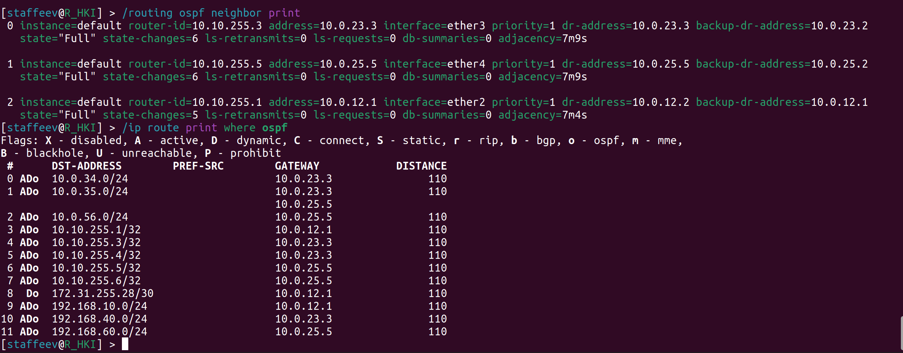
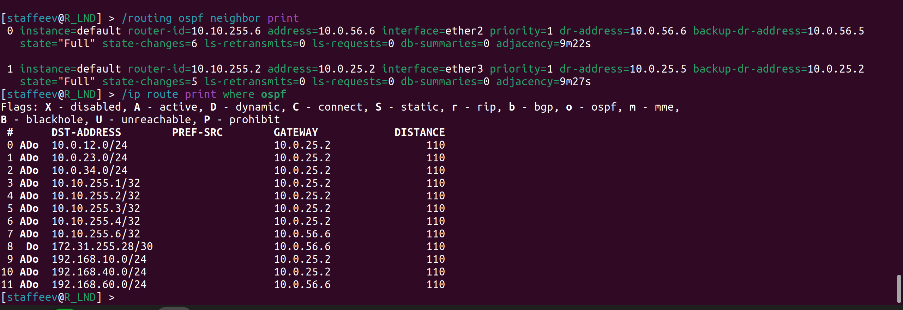
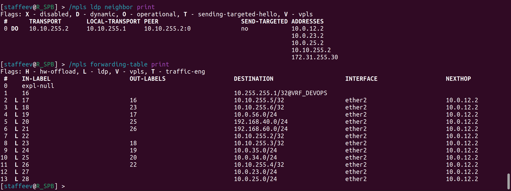
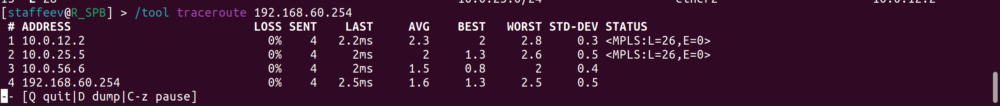

University: [ITMO University](https://itmo.ru/ru/)
Faculty: [FICT](https://fict.itmo.ru)
Course: [Introduction in routing](https://github.com/itmo-ict-faculty/introduction-in-routing)
Year: 2025/2026
Group: K3321
Author: Stafeev Ivan Alekseevich
Lab: Lab3
Date of create: 19.10.2025
Date of finished: 20.10.2025

## Лабораторная работ №4. Эмуляция распределенной корпоративной сети связи, настройка iBGP, организация L3VPN, VPLS

**Цель работы**: изучить протоколы BGP, MPLS и правила организации L3VPN и VPLS.

### Схема сети


Топология это сети в yaml имеет [простой вид](lab3.clab.yaml), поэтому тут дублироваться не будет. Задаются шесть роутеров с указанием стартового конфига и два компьютера, также с указанием конфига, а также связии между ними по аналогии со схемой сети на изображении.


Видно, что сеть собрана правильно с точки зрения устройств и линков между ними.

### Конфигурация конечных устройств

Конфиг для компьютера PC1 и удаленного сервера SGI_Prism имеет следующий вид:

```bash
#!/bin/sh

ip link set eth1 up
udhcpc -i eth1 -q

ip route del default via 172.50.0.1 dev eth0
```

Через `udhcp` происходит запрос ip-адреса и DHCP-сервера. В маршрутах прописывается адрес шлюза, а также удаляется путь по умолчанию, связанный с менеджмент-сетью (она перехватывает все запросы, и компьютеры не могут общаться).

### Конфигурация роутеров

В этой лабораторной работе конфигурация роутеров получилась на порядок сложнее, чем в предудыщей работе, поэтому буду давать конфиги логическими блоками:

Сначала уже традиционно изменяем имя устройства и добавляем нового пользователя:

```bash
/system identity
set name=R_SPB
/user
add name=staffeev password=strongpassword group=full
remove admin
```


На каждом роутере был создан `bridge` loopback для его использования при настройке OSPF (хороший тон, так как этот виртуальнйы интерфейс никогда не отключается, если его не отключить вручную).

```bash
/interface bridge
add name=loopback
```

Следом создаются ip-адреса на интерфейсах роутера. Для `loopback`-интерфейса я прописываю адрес вида `n.n.n.n/32`, который будет не раз применен в дальнейшем. Вот пример для `R01.SPB`

```bash
/ip address
add address=10.0.12.1/24 interface=ether2
add address=10.0.13.1/24 interface=ether3
add address=192.168.10.1/24 interface=loopback
add address=1.1.1.1/32 interface=loopback
```

(для `R01.SPB` и `R01.NY` производитя настройка DHCP-сервера привычгным путем. Пример для СПб:

```bash
/ip pool
add name=dhcp_spb_pool ranges=192.168.10.100-192.168.10.254
/ip dhcp-server network
add address=192.168.10.0/24 gateway=192.168.10.1
/ip dhcp-server
add address-pool=dhcp_spb_pool disabled=no interface=loopback name=dhcp_spb
```
)

**Настройка OSPF**. Для нее нужно выполнить неколько пунктов:

1) Создание зон. Я решил выделить `R01.NY` с его сетью в отдельную зону, поэтому я создю новую зону на роутерах `R01.NY`, `R01.LND` и `R01.LBN` (последние два являются пограничными роутерами):

```bash
/routing ospf area
add name=area_us area-id=0.0.0.1
```

При работе с зонми всегда должна быть backbone-зона с id 0.0.0.0. по умолчанию она уже есть, и я ее прописываю дальше.

2) Создание OSPF-instance. Здесь для дефолтного инстанса я просто устанавливаю routetr-id, равный `n.n.n.n/32` (такой же адрес, как у `loopback`-интерфейса).

```bash
/routing ospf instance
set [find default=yes] router-id=4.4.4.4
```

На "начальном" и "конечном" роетурах (Нью-Йорк и СПб) я еще прописываю команду, которая "вставляет" присоединенные к роутерам маршруты (то есть в сети `192.168.10.0` и `192.168.20.0` в нашем случае) в маршрутизацию OSPF.

```bash
set 0 redistribute-connected=as-type-1
```

Это делать не обязательно, можно просто в `network` добавить эти же сети, но я решил сделать через такую команду.

3) Добавление сетей в OSPF. На каждом роутере каждую связанную с ним сеть нужно прописать с указанием зоны, к которой она принадлежит. Пример для `R01.LBN`:

```bash
/routing ospf network
add area=backbone network=10.0.24.0/24
add area=backbone network=10.0.34.0/24
add area=backbone network=4.4.4.4/32
add area=area_us network=10.0.46.0/24
```


**Настройка MPLS**.

Здесь все проще. Нужно только включить протокол LDP на каждом роутере, прописать LSR-id и указать интерфейсы, на которых будет работать MPLS (все, кроме тех, которые ведут в рабочие сети). Пример для `R01.SPB`:

```bash
/mpls ldp
set enabled=yes lsr-id=1.1.1.1 transport-address=1.1.1.1
/mpls ldp interface
add interface=ether2
add interface=ether3
```

**Настройка VPLS**. В RouteOs нет разграничения между EoMPLS и VPLS (хотя первай технлогия устанавливает маршруты одик-к-одному, а вторая - многие-ко-многим), поэтому будет настроен второй.

Настройка производится только на роутерах `R01.SPB` и `R01.NY`. Сначала создается специальный интерфейс:

```bash
/interface vpls
add name=eompls_to_NY remote-peer=6.6.6.6 vpls-id=100:1 disabled=no
```

(в конфиге для `R01.NY` 6.6.6.6 поменяется на 1.1.1.1 - адрес loopback-интерфейса роутера в СПб)

В конце в `bridge` loopback я добавляю физический интерфейс, ведущий в рабочую сеть, и VPLS-интерфейс.

```bash
/interface bridge port
add bridge=loopback interface=ether4
add bridge=loopback interface=eompls_to_NY
```

На этом конфигурация завершена.


### Проверка работоспособности

#### OSPF








Видно, что все маршруты имеют флаг `o` - ospf (то есть осзданы динамически), а также у каждого роутера есть установленные отношения связности `Full` с соседними роутерами.

#### MPLS




Видно, что у каждого роутера есть соседи, с которыми происходит обмен по протоколу LDP, а также у каждого роутера собраалсь база LFIB, хранящая инфомрацию о всех метках.

Информация о метках также появляется в выводе команды `traceroute`:



#### VPLS

Во-первых, в выводе MPLS для роутеров `R01.SPB` и `R01.NY` они уже были указаны друг для друга как соседи с флагом `V` - vpls.


Во-вторых, в выводе `/interface vpls monitor` также указывается состояние VPLS (метки, next hop и все прочее):


### Заключение

В ходе выполнения лабораторной работы была создана топология сети, состоящая из шести роутеров и двух конечных устройств. Настроена раздача адресов через DHCP и динамическая маршрутизация через OSPF. Был настроен MPLS и VPLS (EoMPLS) над созданной сетью. Таким образом, конечные устройства из разных географических зон могут общаться друг с другом. Цель работы достигнута.