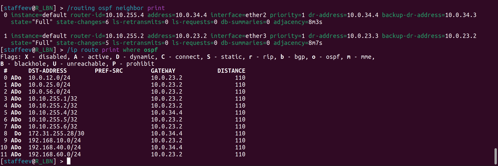

University: [ITMO University](https://itmo.ru/ru/)
Faculty: [FICT](https://fict.itmo.ru)
Course: [Introduction in routing](https://github.com/itmo-ict-faculty/introduction-in-routing)
Year: 2025/2026
Group: K3321
Author: Stafeev Ivan Alekseevich
Lab: Lab3
Date of create: 19.10.2025
Date of finished: 03.11.2025

## Лабораторная работ №4. Эмуляция распределенной корпоративной сети связи, настройка iBGP, организация L3VPN, VPLS

**Цель работы**: изучить протоколы BGP, MPLS и правила организации L3VPN и VPLS.

### Схема сети


Топология это сети в yaml имеет [простой вид](lab4.part1.clab.yaml), поэтому тут дублироваться не будет. Задаются шесть роутеров и три конечных устройства с указанием стартовых конфиг, а также связии между ними по аналогии со схемой сети на изображении.


Видно, что сеть собрана правильно с точки зрения устройств и линков между ними.

### Конфигурация конечных устройств

Конфигурация для всех конечныых устройств имеет один и тот же вид:

```bash
#!/bin/sh

ip link set eth1 up
udhcpc -i eth1 -q

ip route del default via 172.50.0.1 dev eth0
```

Через `udhcp` происходит запрос ip-адреса и DHCP-сервера, также удаляется путь по умолчанию, связанный с менеджмент-сетью (она перехватывает все запросы, и компьютеры не могут общаться).

### Общая конфигурация роутеров

Сначала традиционно изменяем имя устройства и добавляем нового пользователя:

```bash
/system identity
set name=R_SPB
/user
add name=staffeev password=strongpassword group=full
remove admin
```


На каждом роутере был создан `bridge` loopback для его использования при настройке OSPF (хороший тон, так как этот виртуальный интерфейс никогда не отключается, если его не отключить вручную).

```bash
/interface bridge
add name=loopback
```

Следом создаются ip-адреса на интерфейсах роутера. Для `loopback`-интерфейса я прописываю адрес вида `10.10.255.n/32`, который будет не раз применен в дальнейшем. Вот пример для `R01.SPB`

```bash
/ip address
add address=10.0.12.1/24 interface=ether2
add address=192.168.10.1/24 interface=ether3
add address=10.10.255.1/32 interface=loopback
```

(для `R01.SPB`, `R01.SVL` и `R01.NY` производитя настройка DHCP-сервера привычгным путем. Пример для СПб:

```bash
/ip pool
add name=dhcp_spb_pool ranges=192.168.10.100-192.168.10.254
/ip dhcp-server network
add address=192.168.10.0/24 gateway=192.168.10.1
/ip dhcp-server
add address-pool=dhcp_spb_pool disabled=no interface=ether3 name=dhcp_spb
```
)

**Настройка OSPF**. Для нее нужно выполнить неколько пунктов:

1) Создание OSPF-instance. Здесь для дефолтного инстанса я просто устанавливаю routetr-id, равный `10.10.255.n/32` (такой же адрес, как у `loopback`-интерфейса). Еще прописываю команду, которая "вставляет" присоединенные к роутерам маршруты (то есть в сети `192.168.10.0`, `192.168.40.0` и `192.168.60.0` в нашем случае) в маршрутизацию OSPF.

```bash
/routing ospf instance
set [find default=yes] router-id=10.10.255.2
set 0 redistribute-connected=as-type-1
```

Это делать не обязательно, можно просто в `network` добавить эти же сети, но я решил сделать через такую команду.

2) Добавление сетей в OSPF. На каждом роутере каждую связанную с ним сеть нужно прописать с указанием зоны, к которой она принадлежит (в этой работе я оставил всего одну - backbone - зону). Пример для `R01.HKI`:

```bash
/routing ospf network
add area=backbone network=10.0.12.0/24
add area=backbone network=10.0.23.0/24
add area=backbone network=10.0.25.0/24
add area=backbone network=10.10.255.2/32
```


**Настройка MPLS**.

Здесь все проще. Нужно только включить протокол LDP на каждом роутере, прописать LSR-id и указать интерфейсы, на которых будет работать MPLS (включая те, которые идут в "рабочие" сети `192.168.n.0`). Пример для `R01.SPB`:

```bash
/mpls ldp
set enabled=yes lsr-id=10.10.255.1 transport-address=10.10.255.1
/mpls ldp interface
add interface=ether2
add interface=ether3
```


**Настройка BGP** состоит из нескольких шагов:

1) Создание инстанса и добавление BGP-сети. В качестве `router-id` указываю адрес loopback-интерфейса, а в качестве сети - сеть, включающую в себя адреса loopback'ов.

```bash
/routing bgp instance
set default as=65531 router-id=10.10.255.2 cluster-id=10.10.10.10
/routing bgp network
add network=10.10.255.0/24
```

Здесь важно отметить, что по заданию необходимо создать route-reflect кластер. Указание кластера (`cluster-id`) присутствует только в одном роутере (`R01.HKI`). Так как каждый пакет, идущий от одного конечного устройства к другому, проходит через два роутера, то если на каждом будет один и тот же `cluster-id`, этот пакет отбросится (так работает iBGP).

2) Добавление пиров. Для каждого пира нужно указать удаленный адрес (снова это адрес loopback-интерфейса). Для тех роутеров, которые входят в route-reflect кластер, нужно соответствующий параметр активировать (`route-reflect=yes`). Пример для `R01.HKI`: 

```bash
/routing bgp peer
add name=peer_SPB remote-address=10.10.255.1 remote-as=65531 address-families=l2vpn,vpnv4 instance=default update-source=loopback
add name=peer_LBN remote-address=10.10.255.3 remote-as=65531 address-families=l2vpn,vpnv4 instance=default update-source=loopback route-reflect=yes
add name=peer_LND remote-address=10.10.255.5 remote-as=65531 address-families=l2vpn,vpnv4 instance=default update-source=loopback route-reflect=yes
```

Очень важно указать `address-families=l2vpn,vpnv4` для включения L2VPN и L3VPB, без этого пакеты протокола доходить до адресатов не будут.

### Часть 1. Настройка VRF

На "конечных" роутерах (SPB, SVL, NY) для начала я создаю еще один bridge и даю ему адрес вида `10.255.255.n/32`:

```bash
/interface bridge
add name=vrf_bridge
/ip address
add address=10.255.255.1/32 interface=vrf_bridge
```

Далее необходимо создать инстанс (я меняю дефолтный) с указанием метки VRF и с флагом `redistribute-connected=yes` для распространения на подключенные к роутерам рабочие сети. Затем непосредственно настраивается VRF с указанием созданное ранее метки, интерфейса и RD (не имеет значения, какое именно номер, ведь у нас всего одна VRF) и RT (export и import, решил сделать их одинаковыми). Пример для `R01.SPB`:

```bash
/routing bgp instance vrf
add routing-mark=VRF_DEVOPS redistribute-connected=yes
/ip route vrf
add routing-mark=VRF_DEVOPS interfaces=vrf_bridge export-route-targets=65531:101 import-route-targets=65531:101 route-distinguisher=65531:1
```


### Часть 2. Настройка VPLS

Настройка аналогично VRF происходит только на конечных роутерах. Создается bridge, к нему добавляется порт, идущий к конечному устройству, и задается ip вида `10.255.255.n/32`. В конце настраивается сам VPLS над BGP с указанием созданного bridge, RD и RT (такие же, как в VRF), и дается уникальный `site-id`. Пример для `R01.SPB`:

```bash
/interface bridge
add name=vpls_bridge
/interface bridge port
add bridge=vpls_bridge interface=ether3
/ip address
add address=10.255.255.1/32 interface=vpls_bridge
/interface vpls bgp-vpls
add bridge=vpls_bridge site-id=1 route-distinguisher=65531:1 import-route-targets=65531:101 export-route-targets=65531:101
```

Из DHCP-серверов на трех роутерах был оставлен только один на `R01.NY`, чтобы все конечные устройства получили адреса из одной подсети.

### Проверка работоспособности

#### OSPF





Видно, что все маршруты имеют флаг `o` - ospf (то есть осзданы динамически), а также у каждого роутера есть установленные отношения связности `Full` с соседними роутерами.

#### MPLS


Видно, что у каждого роутера есть соседи, с которыми происходит обмен по протоколу LDP, а также у каждого роутера собраалсь база LFIB, хранящая инфомрацию о всех метках.

Информация о метках также появляется в выводе команды `traceroute`:


#### VPLS

Во-первых, в выводе MPLS для роутеров `R01.SPB` и `R01.NY` они уже были указаны друг для друга как соседи с флагом `V` - vpls.


Во-вторых, в выводе `/interface vpls monitor` также указывается состояние VPLS (метки, next hop и все прочее):


### Заключение

В ходе выполнения лабораторной работы была создана топология сети, состоящая из шести роутеров и трех конечных устройств. Настроена раздача адресов через DHCP и динамическая маршрутизация через OSPF. Был настроен MPLS, BGP и VRF / VPLS над созданной сетью. Таким образом, конечные устройства из разных географических зон могут общаться друг с другом. Цель работы достигнута.